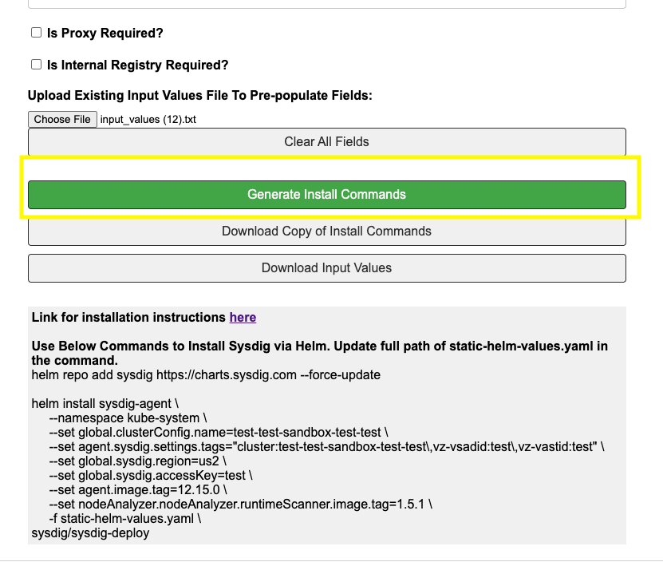
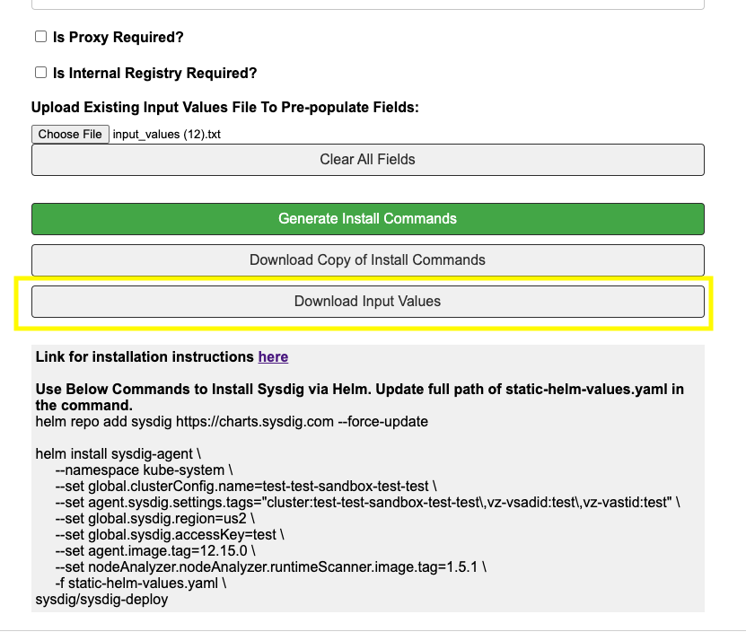

## Installation

* Fill out form located here: https://alexwang19.github.io/
* Please fill out required fields
* Add proxy and/or internal registry if that applies
* Click "Generate Install Commands" to generate helm install commands along with downloading static config.yaml file 
* Files needed for install will be downloaded to your Downloads folder. Please place static-helm-values.yaml in folder where helm install command will be executed.
* "Download Copy of Install Commands" downloads helm install command instructions to text file for future reference 
* "Download Input Values" downloads input values submitted. This can be used in future by uploading file under "Upload Input Values File". It will auto-populate fields based on input values file.  
* To remove existing uploaded file, please select "Clear All Fields"
* Refer the Helm Quickstart [below](#helm-quickstart) for command references
