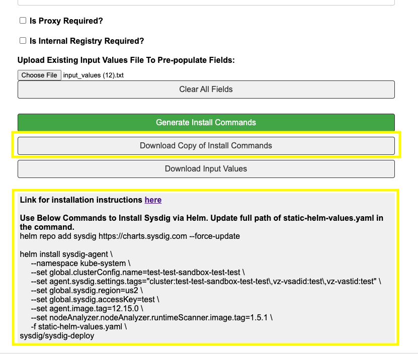

## Table of Contents
* [Requirements](#requirements)
* [Installation](#installation)
* [Verify Installation](#verify-installation)
* [Helm Quickstart](#helm-quickstart)


## Requirements

* Access to kubernetes cluster. Ex: "kubectl get pods -A" returns list of pods running on cluster
* kubectl version must be +-1 of kubernetes cluster. Ex: K8s cluster v1.25, kubectl(client) version is recommended to be no lower than v1.24
  * ```
    kubectl version --short
    
    Client Version: v1.26.0
    Kustomize Version: v4.5.7
    Server Version: v1.25.11-eks-a5565ad
    ```
* Appropriate helm version installed. Compatibility table found [here](https://helm.sh/docs/topics/version_skew/).
  * ```
     helm version
    
     version.BuildInfo{Version:"v3.12.1", GitCommit:"f32a527a060157990e2aa86bf45010dfb3cc8b8d", GitTreeState:"clean", GoVersion:"go1.20.5"}
    ```
* Ensure adequate resources on nodes are available:
  * ```
    kubectl describe nodes

    Allocated resources:
     Resource                    Requests      Limits
     --------                    --------      ------
     cpu                         1525m (38%)   2150m (54%)
     memory                      1756Mi (11%)  5440Mi (36%)
     ephemeral-storage           3322Mi (19%)  6394Mi (36%)
     hugepages-1Gi               0 (0%)        0 (0%)
     hugepages-2Mi               0 (0%)        0 (0%)
     attachable-volumes-aws-ebs  0             0
    ```
* Port 6443 open for outbound traffic The Sysdig Agent communicates with the collector on port 6443. If you’re using a firewall, make sure to open port 6443 for outbound traffic so that the agent can communicate with the collector. This also applies to proxies. Ensure that port 6443 is open on your proxy.
  * Validate connection using commands below:
    ```
    export http{s,}_proxy=http://myproxy.com:8080
    curl -sL ingest-us2.app.sysdig.com:6443 -v
    ```
* If using a proxy, make sure to include clusterIP in the no_proxy list in the onboarding form.
  * Command to find clusterIP: 
    ```
    kubectl get service kubernetes -o jsonpath='{.spec.clusterIP}'; echo
    ```
* [Agent Requirement Docs](https://docs.sysdig.com/en/docs/installation/sysdig-secure/install-agent-components/installation-requirements/sysdig-agent/)

## Installation

* Fill out form located here: https://alexwang19.github.io/
* Please fill out required fields
* Add proxy and/or internal registry if that applies
* Click "Generate Install Commands" to generate helm install commands along with downloading static config.yaml file 
* Files needed for install will be downloaded to your Downloads folder. Please place static-helm-values.yaml in folder where helm install command will be executed.
* "Download Copy of Install Commands" downloads helm install command instructions to text file for future reference 
* "Download Input Values" downloads input values submitted. This can be used in future by uploading file under "Upload Input Values File". It will auto-populate fields based on input values file.  
* To remove existing uploaded file, please select "Clear All Fields"
* Refer the Helm Quickstart [below](#helm-quickstart) for command references

## Verify Installation

* Ensure all sysdig pods are 1/1 Running state.
* Double check the largest image size to make sure a new larger image is not encountered.
* If a new and larger image is encountered, we may need to tune the runtime scanner to accommodate the larger size.
* You can also watch for log messages with "too" that say image scans are being skipped due to size.
* Grep all of the agent pod logs for "Error," and ensure there are no recurring errors of concern.
* Grep all of the agent pod logs for "POLICIES_V2". You should see something like "Received command 22 (POLICIES_V2)" This signifies that the pod is up and running successfully.
* Grep all of the agent node analyzer pod logs for "\"level\":\"error\"" and ensure there are no recurring errors of concern.
* Sometimes you will see recurring errors if a scan is attempted for an application pod that has not come up or is failing.
* Grep all of the agent node analyzer pods logs for "\"message\":\"startup sleep\"". This signifies that the pod is up and running successfully.

## Helm Quickstart

### Initialize Sysdig Helm Chart Repository
```
helm repo add sysdig https://charts.sysdig.com --force-update
```

### Install Sysdig Chart
* [Helm Install Docs](https://helm.sh/docs/helm/helm_install/)
```
helm install sysdig-agent \
--namespace <namespace> \
--set global.sysdig.accessKey=<access-key> \
...
-f example-values-file.yaml \
sysdig/sysdig-deploy
```

### Upgrade Sysdig Deployment or Override Values
* Refer to these docs for additional params: [Helm Upgrade Docs](https://helm.sh/docs/helm/helm_upgrade/)
* helm upgrade --force to override values
```
helm upgrade sysdig-agent \
 --namespace <namespace> \
 --set global.sysdig.accessKey=<access key> \
 --set agent.image.tag=<version> \
 --set nodeAnalyzer.nodeAnalyzer.runtimeScanner.image.tag=<version> \
 ...
 -f example-values-file.yaml \
sysdig/sysdig-deploy
```

```
helm upgrade --force sysdig-agent \
 --namespace <namespace> \
 --set global.sysdig.accessKey=<access key> \
 ...
 -f example-values-file.yaml \
sysdig/sysdig-deploy
```

### List Releases
* [Helm List Docs](https://helm.sh/docs/helm/helm_list/)
```
helm list --namespace <namespace>
```

### View Status
* [Helm Status Docs](https://helm.sh/docs/helm/helm_status/)
```
helm status sysdig-agent --namespace <namespace>
```

### Delete Sysdig Deployment (Uninstall)
* [Helm Uninstall Docs](https://helm.sh/docs/helm/helm_uninstall/)
```
helm uninstall sysdig-agent --namespace <namespace>
```

### Delete Sysdig Deployment (Deprecated)
```
helm delete sysdig-agent --namespace <namespace>
```

